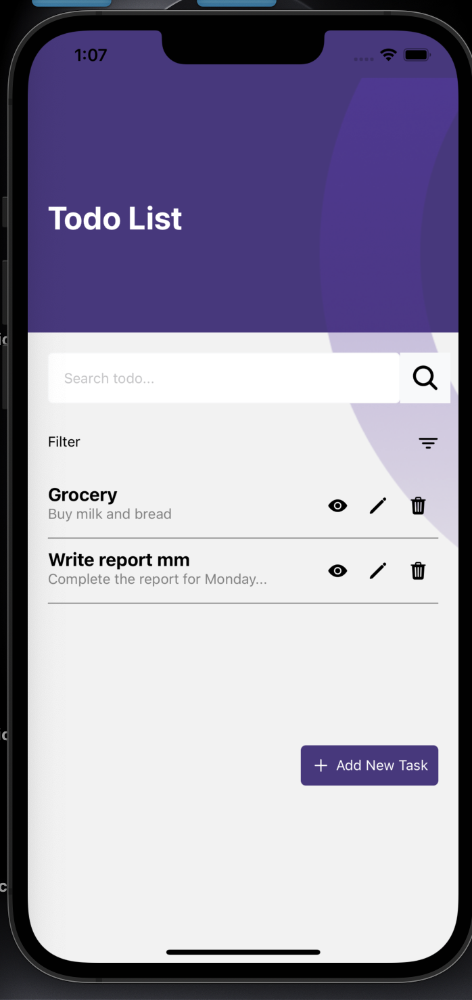
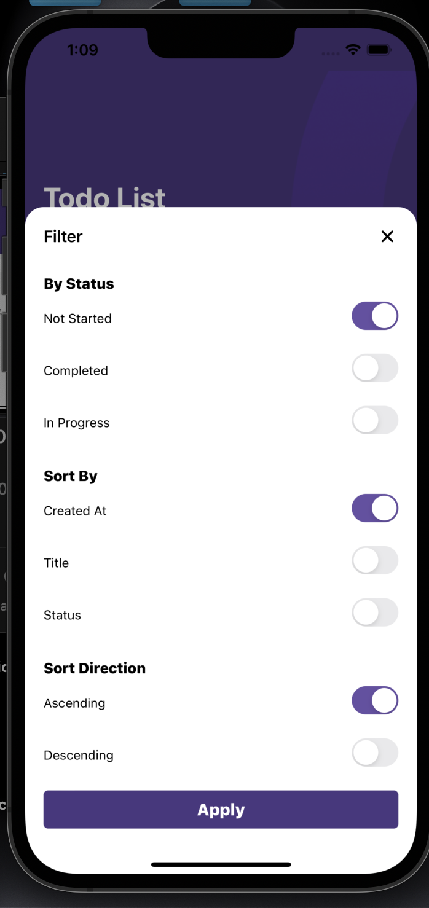
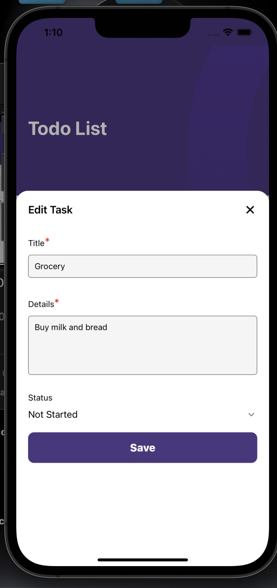

# Todo Mobile App

## Overview

The Todo Mobile App is a simple and intuitive application designed to help users manage their daily tasks efficiently. With this app, users can add, edit, and delete tasks, as well as mark them as completed.

## Features

- Add new tasks
- Edit existing tasks
- Delete tasks
- filter, sort the task using the filter icon
- Mark tasks as completed, in progress, not started by changing their status
- User-friendly interface
- search task by title and details
- Restore tasks from the bin after deletion
- Permanently delete tasks from the bin

## Usage

1. Open the app on your mobile device.
2. Add tasks by clicking the "Add Task" button.
3. View, edit, and delete tasks using the icons adjacent to the created task.
4. Mark tasks as completed, in progress, not started by changing their status

### Screenshots

